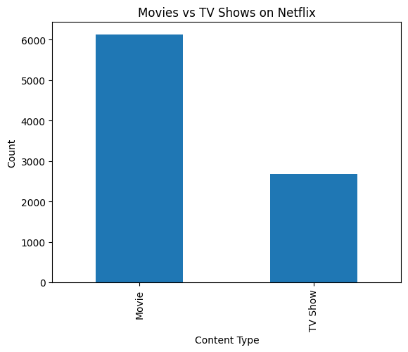
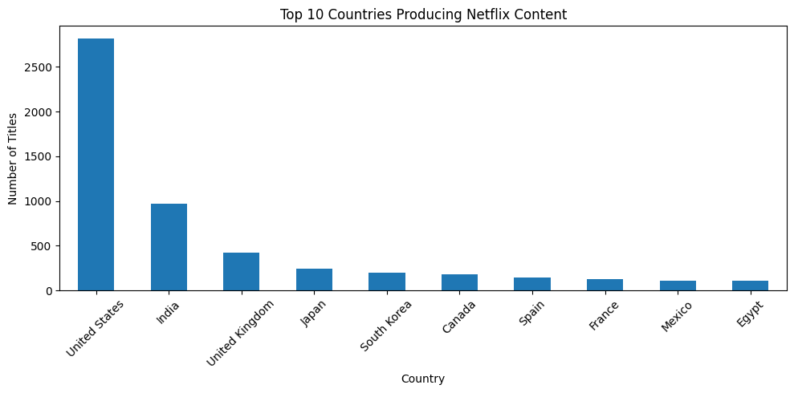
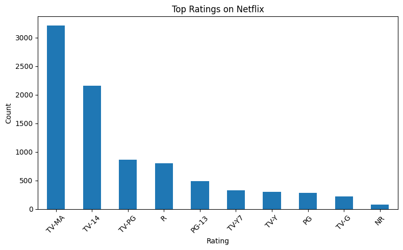
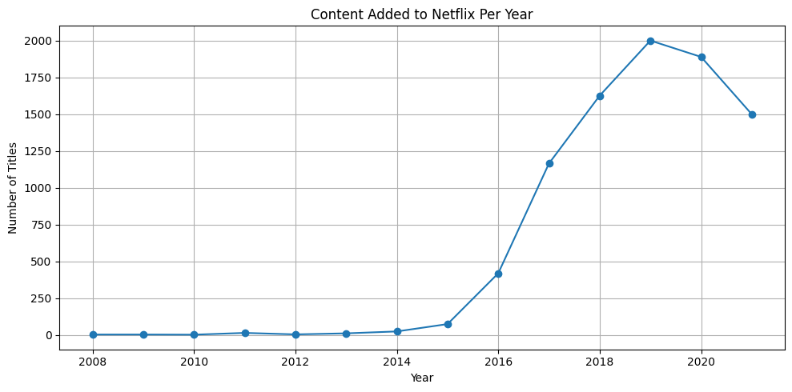
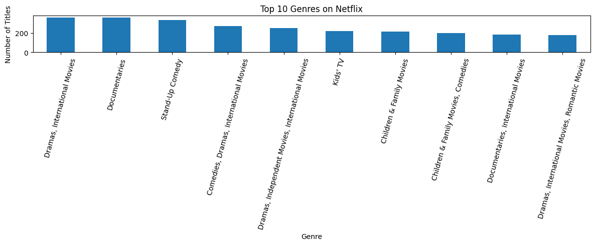

# Netflix Data Analysis

## Project Overview

This project performs Exploratory Data Analysis (EDA) on the Netflix Movies and TV Shows dataset using Python, Pandas, and Matplotlib.

The objective of this project is to analyze Netflix's content catalog and uncover trends related to content type, ratings, countries, genres, and yearly content growth.

---

## Tools & Technologies Used

- Python
- Pandas
- NumPy
- Matplotlib
- Google Colab
- GitHub

---

## Dataset

Dataset: Netflix Movies and TV Shows

Source:
https://www.kaggle.com/datasets/shivamb/netflix-shows

The dataset contains information about Netflix titles including:

- Content Type
- Title
- Director
- Cast
- Country
- Date Added
- Release Year
- Rating
- Duration
- Genre
- Description

---

## Data Cleaning

The following preprocessing steps were performed:

- Checked dataset structure and missing values
- Handled null values using appropriate replacements
- Checked for duplicate records
- Converted date columns to datetime format
- Created new features for analysis:
  - year_added
  - month_added
  - day_added
  - duration_num

---

## Exploratory Data Analysis

### 1. Movies vs TV Shows
Analyzed the distribution of Movies and TV Shows available on Netflix.

### 2. Top Countries Producing Netflix Content
Identified countries contributing the highest amount of content.

### 3. Ratings Distribution
Analyzed the most common content ratings available on Netflix.

### 4. Content Added Per Year
Studied Netflix's content growth trend over time.

### 5. Top Genres
Explored the most popular genres on the platform.

---

## Visualizations

### Movies vs TV Shows



### Top Countries



### Ratings Distribution



### Content Added Per Year



### Top Genres



---

## Key Findings

- Movies significantly outnumber TV Shows on Netflix.
- The United States contributes the highest amount of content.
- India is the second-largest contributor.
- TV-MA and TV-14 are the most common ratings, indicating a strong focus on mature and teenage audiences.
- Netflix experienced rapid content growth between 2016 and 2019.
- Content additions peaked in 2019.
- Drama, Documentaries, and Stand-Up Comedy are among the most popular genres.
- Content production is concentrated among a few major countries.

---

## Project Structure

```text
Netflix-Data-Analysis/
│
├── Netflix_Data_Analysis.ipynb
├── README.md
├── LICENSE
├── movies_vs_tvshows.png
├── top_countries.png
├── ratings_distribution.png
├── content_added_per_year.png
└── top_genres.png
```

---

## Future Improvements

- Perform genre-level trend analysis
- Create interactive dashboards using Power BI or Tableau
- Compare Movies and TV Shows separately
- Build a recommendation-based analysis

---

## Author

**Neel Abhishek**

Aspiring Data Analyst / Data Engineer

GitHub: https://github.com/neelabhishek20

---

## License

This project is licensed under the MIT License.
